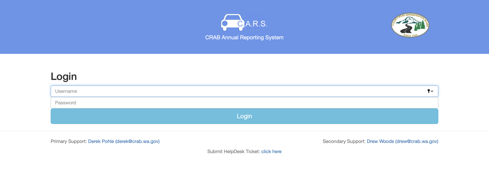

# Oregon’s CRAB Annual Reporting System

|                   |                                          |
|:------------------|:-----------------------------------------|
| model             | Top-Down
| service type      | Transportation
| country           | United States
| states            | Oregon
| government type   | state
| license           | unknown
| website           | [https://www.crab.wa.gov/services/crab-information-services/crab-software](https://www.crab.wa.gov/services/crab-information-services/crab-software)

## Description
"The CRAB Annual Reporting System (C.A.R.S.) allows county staff to electronically fill in information on all of the required annual reports and submittals due to [the County Road Administration Board] throughout the year.”

This was built by agency staff around 2005, but [is being replaced with GIS-Mo](https://www.crab.wa.gov/services/crab-information-services/gis-mo-asset-management-software), a commercial solution. This replacement was due to start in early 2021.
