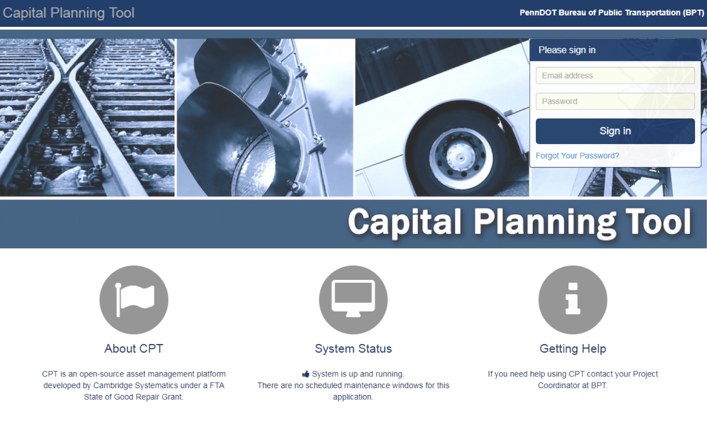

# Pennsylvania Capital Planning Tool

|                   |                                          |
|:------------------|:-----------------------------------------|
| model             | Built Here, Others Use
| service type      | Transportation
| country           | United States
| states            | Pennsylvania
| government type   | state
| license           | unknown
| website           | [https://pa-cpt.camsys-apps.com/users/sign_in](https://pa-cpt.camsys-apps.com/users/sign_in)
| another website   | [https://www.penndot.gov/Doing-Business/Transit/InformationandReports/Documents/PennDOT%20Group%20TAM%209-27-2018.pdf](https://www.penndot.gov/Doing-Business/Transit/InformationandReports/Documents/PennDOT%20Group%20TAM%209-27-2018.pdf)

## Description
An open-source asset management platform developed by a private vendor for the Pennsylvania Bureau of Public Transportation. There’s cause to believe that Pennsylvania is looking to share this with other states.
