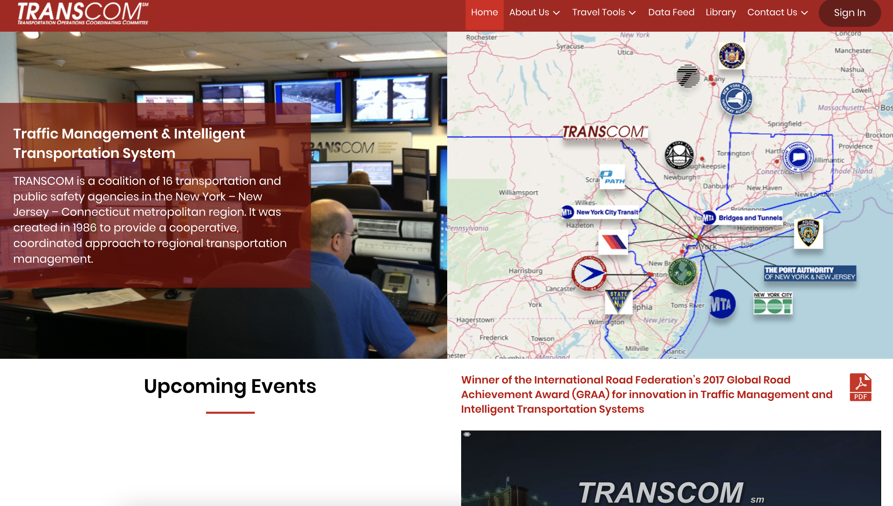

# TRANSCOM

|                   |                                          |
|:------------------|:-----------------------------------------|
| model             | Collaborative Organizational Development
| service type      | Transportation
| country           | United States
| states            | CT, NJ, NY
| government type   | state
| website           | [https://xcm.org/home](https://xcm.org/home)

## Description
They say:

>TRANSCOM is a coalition of 16 transportation and public safety agencies in the New York-New Jersey-Connecticut metropolitan region. It was created in 1986 to provide a cooperative, coordinated approach to regional transportation management.
>
>TRANSCOM improves the mobility and safety of the traveling public by supporting its member agencies through interagency communication and the enhanced utilization of their existing traffic and transportation management systems. 

It has 16 different member agencies in three states, including the New York City Department of Transportation, New Jersey State Police, and Metropolitan Transportation Authority. It acts as a forum for collaboration and innovation between member agencies within future systems.

TRANSCOM is funded by the Federal Highway Administration.
