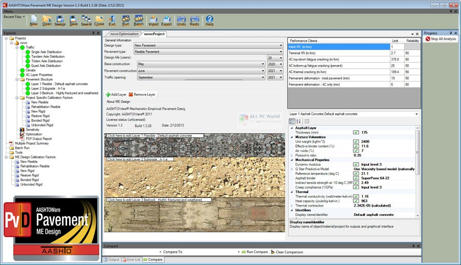

# AASHTOWare

|                   |                                          |
|:------------------|:-----------------------------------------|
| model             | Collaborative Organizational Development
| service type      | Transportation
| country           | United States
| states            | AK, AL, AR, AZ, CA, CO, CT, DE, FL, GA, HI, IA, ID, IL, IN, KS, KY, LA, MA, MD, ME, MI, MN, MO, MS, MT, NC, ND, NE, NH, NJ, NM, NV, NY, OH, OK, OR, PA, RI, SC, SD, TN, TX, UT, VA, VT, WA, WI, WV, WY, DC, PR
| government type   | state
| license           | closed
| website           | [https://www.aashtoware.org/](https://www.aashtoware.org/)
| another website   | [https://www.aashtowareproject.org/](https://www.aashtowareproject.org/)

## Description
They say:

>AASHTOWare is a unique and powerful enterprise software suite designed by transportation professionals for transportation professionals. No other software matches its effectiveness for transportation project design and management. Why? Because no other software is cooperatively developed and continually updated by experts from state transportation agencies across the nation.

[AASHTOWare is a suite of 16 tools](https://www.aashtoware.org/products/project/project-modules/) produced by the [American Association of State Highway and Transportation Officials](https://www.transportation.org/) (AASHTO), with functionality ranging from project estimation to labor management, project bidding to data analytics. Five of those tools are web-based, and eleven of them use a Windows client-server architecture. The software can be hosted by AASHTO member agencies, or [they can pay AASHTO’s vendor, Infotech, for centralized hosting](https://www.aashtoware.org/wp-content/uploads/2018/12/AWP_CloudHosting_2019_FINAL.pdf).

AASHTO is a nonprofit, nonpartisan association that represents the member highway and transportation departments in the 50 states, the District of Columbia, and Puerto Rico. It is over a century old.

AASHTOWare traces its roots to 1985, when AASHTO licensed Infotech’s Bid Analysis and Management System.

AASHTOWare has a license agreement that members must adhere to. [A site license for every tool in the AASHTOWare suite](https://www.aashtoware.org/wp-content/uploads/2020/05/E-FY2021-Member-Software-Request-Forms.pdf) runs $514,000/year, as of 2021.

The organization employs no software developers — all development is outsourced. AASHTO reports that [80–90% of their licensing fees are used to cover software development services](https://www.aashtoware.org/about/faq/).

The [AASHTOWare project licensing documentation](https://www.aashtoware.org/products/project/project-ordering/) shows the complex ownership of the various components of AASHTOWare:

> AASHTOWare Project Estimator and AASHTOWare Project FieldNet are proprietary software products of Infotech, Inc., Gainesville, Florida. The AASHTOWare Project FieldManager suite (including AASHTOWare Project FieldManager, AASHTOWare Project FieldBook and AASHTOWare Project FieldBuilder) is a proprietary software product jointly owned by Infotech, Inc. and the State of Michigan. The SYNC Service for AASHTOWare Project is a service owned by Infotech, Inc. AASHTO and its licensees have been granted a license to use the AASHTOWare Project Estimator, AASHTOWare Project FieldManager, and AASHTOWare Project FieldNet software as well as the SYNC Service for AASHTOWare Project by an agreement with Infotech, Inc. 

Historically, AASHTOWare’s various components were wholly owned by AASHTO, but recently they have transitioned to also using some existing commercial software, which they relicense to members, splitting the licensing revenue with the vendors.

Interestingly, [AASHTOWare’s Bridge Management software was developed in the early 1990s under the National Cooperative Highway Research Program](https://www.aashtowarebridge.com/), using Federal Highway Administration funding, before being transferred to AASHTO as a permanent home.

AASHTOWare employs a unique development-oversight model. They use waterfall-style software development (producing detailed requirements for vendors to develop against), but those requirements are developed by teams of volunteers that are comprised of employees of state transportation agencies. These same volunteers then monitor vendor performance and serve as the users for acceptance testing. These volunteers are often engineers who developed the very standards that the software supports the implementation of, and in this way AASHTO centers user needs.
