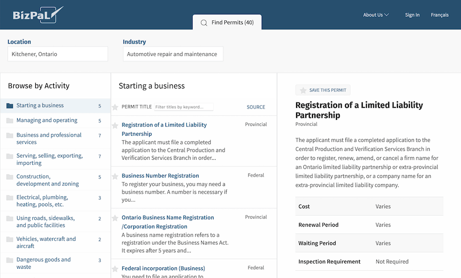

# BizPaL

|                   |                                          |
|:------------------|:-----------------------------------------|
| model             | Collaborative Organizational Development
| service type      | Other
| country           | Canada
| government type   | mixed
| license           | unknown
| website           | [https://bizpal.ca/](https://bizpal.ca/)

## Description

“Launched in 2005, BizPaL is jointly managed by a partnership involving governments at the federal, provincial, territorial and municipal levels. Provinces, territories and hundreds of municipalities have collaborated together to provide you with the permits and licences that may be required to start and grow your business.”

BizPaL is a free online service that helps Canadian businesses identify the permits and licenses they need, and how they can obtain them. After users select their expected business activities, BizPaL automatically generates a list of permits and licenses required by every level of government. This list includes basic information about the permits and licenses, in addition to links to the appropriate government websites.

While the maintenance structure for BizPaL is not completely clear, jurisdictions are individually responsible for inputting their relevant permits and licenses and providing their own interface. Governments are also responsible for recruiting new municipalities -- the federal government encourages participation from provinces, and provinces encourage participation from local governments. [According to Small Business Trends](https://smallbiztrends.com/2016/11/starting-a-small-business-in-canada-as-an-american.html), BizPaL is provided by Innovation, Science and Economic Development Canada (formerly known as Industry Canada).
