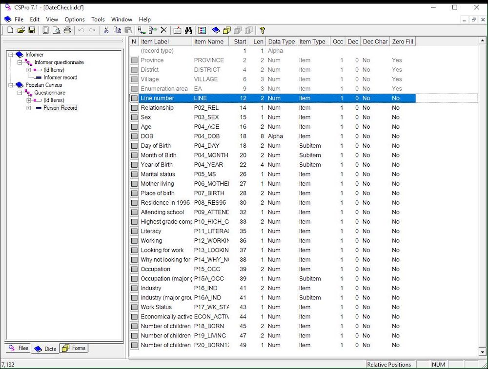

# Census and Survey Processing System

|                   |                                          |
|:------------------|:-----------------------------------------|
| model             | Built Here, Others Use
| service type      | Other
| country           | United States
| government type   | national
| license           | open
| website           | [https://www.census.gov/data/software/cspro.html](https://www.census.gov/data/software/cspro.html)

## Description

The Census and Survey Processing System (CSPro) is a public domain software package used by hundreds of organizations and tens of thousands of individuals for entering, editing, tabulating, and disseminating census and survey data. CSPro is used in over 160 countries. It’s developed and supported by the U.S. Census Bureau and ICF Macro, the organization that implements the Demographic and Health Surveys (DHS). Funding for the development and maintenance of CSPro is primarily provided by the United States Agency for International Development (USAID). Windows-based, with an Android-based data collection component.
