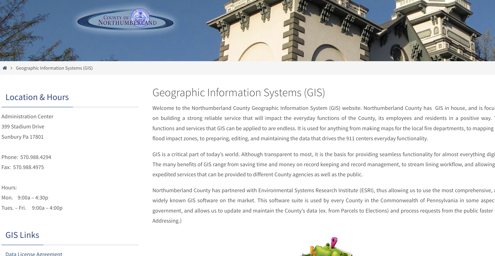

# County of Northumberland Geographic Information System

|                   |                                          |
|:------------------|:-----------------------------------------|
| model             | Collaborative Organizational Development
| service type      | Information Technology
| country           | United States
| states            | PA
| government type   | county
| license           | unknown
| website           | [https://www.norrycopa.net/index.php/geographic-information-systems/] (https://www.norrycopa.net/index.php/geographic-information-systems/)

## Description
Northumberland County has GIS in house, and is focused on building a strong reliable service that will impact the everyday functions of the County, its employees and residents in a positive way.

Northumberland County has partnered with Environmental Systems Research Institute (ESRI), thus allowing us to use the most comprehensive, and widely known GIS software on the market. This software suite is used by every County in the Commonwealth of Pennsylvania in some aspect of government, and allows us to update and maintain the County’s data (ex. from Parcels to Elections) and process requests from the public faster (ex. Addressing.)
