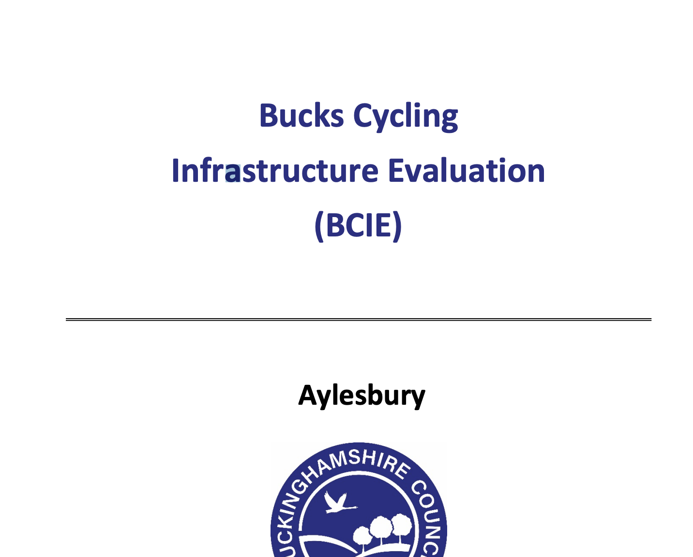

# Collector App

|                   |                                          |
|:------------------|:-----------------------------------------|
| model             | Built Externally, Agencies Contribute
| service type      | Information Technology
| country           | United Kingdom
| government members | Oxfordshire County, Buckinghamshire County
| government type   | municipal
| license           | unknwon
| status            | inactive
| website           | [https://theodi.org/wp-content/uploads/2020/07/2020-06_BCIE-Bucks-Cycling-Infrastructur-Evaluation-FINAL.pdf](https://theodi.org/wp-content/uploads/2020/07/2020-06_BCIE-Bucks-Cycling-Infrastructur-Evaluation-FINAL.pdf)

## Description
The Bucks Cycle Infrastructure Evaluation (BCIE) ran for 5 months between November 2019 and March 2020. It was conducted by Buckinghamshire Council's Business Improvement Team and commissioned by Oxfordshire County Council (iHUB) as part of the Open Data Institute Local Government Open Geospatial Stimulus Fund funded by Innovate UK.
