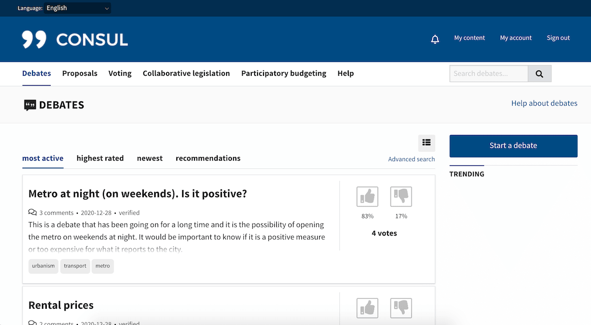

# CONSUL

|                   |                                          |
|:------------------|:-----------------------------------------|
| model             | Built Open, Then Privatized
| service type      | Public Services
| country           | Spain
| government type   | 
| license           | open
| website           | [http://consulproject.org/en/](http://consulproject.org/en/)
| another website   | [https://consulfoundation.org/](https://consulfoundation.org/)

## Description

Created by City of Madrid employees, this citizen participation tool is in use by 35 governments and 135 institutions. It is maintained by the [Consul Democracy Foundation](https://consulfoundation.org/), which has a board comprised of private organizations. The foundation allows for “certified and collaborating companies to offer installation, maintenance, and development services.” These [collaborating companies](https://consulproject.org/docs/collaborating_and_certified.pdf) must contribute to Consul code, install Consul at a public institution, and dedicate at least 5% of the resources from providing these services back to maintenance of the overall Consul project.

Examples of CONSUL features include:
- Online threads for citizens to engage in debate
- Platforms to create citizens' proposals and seek support
- Platforms to create participatory budgeting proposals
- Mobile voting
- Feedback channels for legislation 
