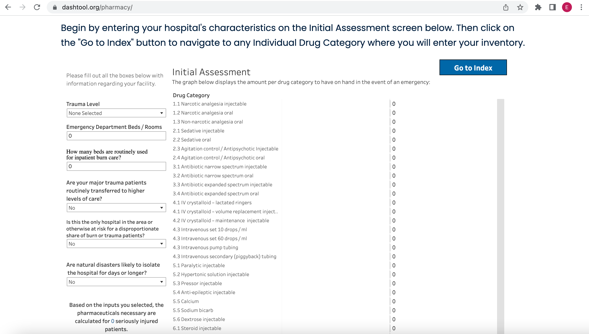

# Disaster Available Supplies in Hospitals (DASH)

|                   |                                          |
|:------------------|:-----------------------------------------|
| model             | Built Here, Others Use
| service type      | Public Health
| country           | United States
| government members | Department of Health and Human Services
| government type   | national
| license           | unknown
| website           | [https://dashtool.org] (https://dashtool.org)

## Description
Disaster Available Supplies in Hospitals (DASH) is an interactive tool that can help hospital emergency planners and supply chain staff estimate supplies that may need to be immediately available during various mass casualty incidents (MCI) and infectious disease emergencies based on hospital characteristics to ensure adequate supplies are available at the time of an incident. DASH recommends average par levels for specific supplies that acute care hospitals may need to have on hand to respond to a disaster in their community until resupplied. Recommendations are based on user inputs about the size of the hospital, risks in the community, regional role/designation of the hospital, and other factors. It does not require or dictate to hospitals what supplies they should have. 

DASH reflects current knowledge of existing scientific guidance and operational experience; users should be aware that the evidence base for MCI and special pathogen response continues to evolve. All recommendations were current at the time of publication and vetted to the best of our ability.

The U.S. Department of Health and Human Services’ Office of the Assistant Secretary for Preparedness and Response (ASPR)’s Technical Resources, Assistance Center, and Information Exchange (TRACIE) and Healthcare Ready developed DASH in collaboration with: ASPR TRACIE Senior Editor, John Hick, MD, Hennepin Healthcare; the Health Industry Distributors Association (HIDA); and the Region VII Disaster Health Response Ecosystem. The development team would like to thank the following who provided input and review: ASPR’s National Healthcare Preparedness Program, ASPR Division of Critical Infrastructure Protection, the ASPR TRACIE Subject Matter Expert Cadre, the National Emerging Special Pathogens Training and Education Center (NETEC), and the Region I, IV, and VIII Regional Disaster Health Response System (RDHRS) sites. Subject matter experts who reviewed each module are acknowledged in the respective module’s methodology document.

This project was funded by the U.S. Department of Health and Human Services, Office of the Assistant Secretary for Preparedness and Response.
