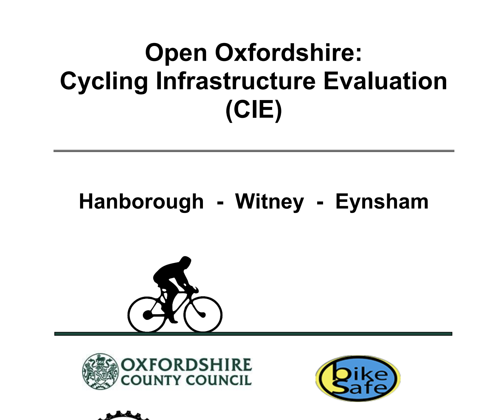

# Digital Cycle Audit Tool (DCRAT)

|                   |                                          |
|:------------------|:-----------------------------------------|
| model             | Collaborative Independent Development
| service type      | Transportation
| country           | United Kingdom
| government members | Oxfordshire County
| government type   | municipal
| license           | unknown
| status            | inactive
| website           | [https://drive.google.com/file/d/1dozE-acykNmRWAzMGh_XLbUMZodgJUTT/view] (https://drive.google.com/file/d/1dozE-acykNmRWAzMGh_XLbUMZodgJUTT/view)

## Description
DCRAT aimed to demonstrate how crowdsourcing could be used to generate open geospatial data for the benefit of local government, institutions, community organizations and the wider public. 

The Open Oxfordshire: Cycle Infrastructure Evaluation (CIE) ran for a duration of 6 months between October 2018 and March 2019. It was conducted by Oxfordshire County Council’s Research and Innovation Department (iHUB) and was funded by the Open Data Institute (ODI).
