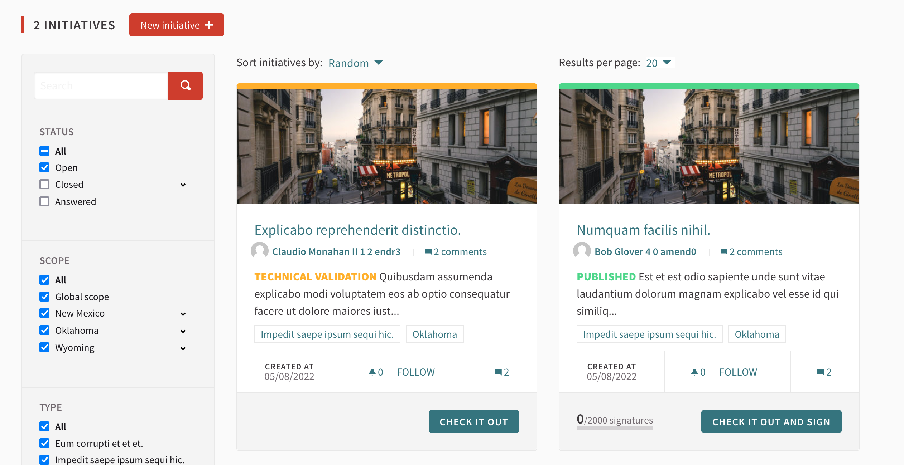

# Decidim

|                   |                                          |
|:------------------|:-----------------------------------------|
| model             | Built Externally, Agencies Contribute
| service type      | 
| countries         | Spain, France, Belgium, Canada, Italy, Catalunya, European Commission
| cities            | Barcelona, New York City, Helsinki, Mexico City, Milan, Zürich, Kakogawa City, Tampere, Luzern, Rosario, Mérida, Trondheim, Belém, Gdynia, Turku, Stavanger, Pamplona, Getxo, Lausanne, Calafell, Elogie-Siemp, Esparreguera, Esplugues, Waterloo, Roubaix, Nancy, Veracruz, Uccle, Tuusula, Terrassa, Sant Cugat, Sant Boi de Llobregat, Salt, Sabadell, Romainville, Reus, Nivelles, Nanterre, Malgrat de Mar, Loiret, Hospitalet
| government type   | 
| license           | AGPL
| website           | [https://decidim.org/](https://decidim.org/)

## Description
Decidim is a Free Open-Source participatory democracy platform for cities and organizations. But Decidim is more than a digital platform: it’s a common's free and open project and infrastructure involving code, documentation, design, training courses, a legal framework, collaborative interfaces, user and facilitation communities, and a common vision.

Decidim is a platform for citizen participation made by the people and for people. Its source code is open and can be inspected, modified, and enhanced by anyone. The Decidim software is covered by the AGPL license. That means that you can use it, modify it and redistribute derived versions of it as long as you respect the AGPL license.

Metadecidim is the community of Decidim that collaborates in the design of the platform and the construction of the Decidim project. It meets regularly through the SOM (Metadecidim Operative Sessions) and the LAB Research Seminars. Go to [meta.decidim.org](https://meta.decidim.org) to follow the calls closely and if you want to join the community. 
