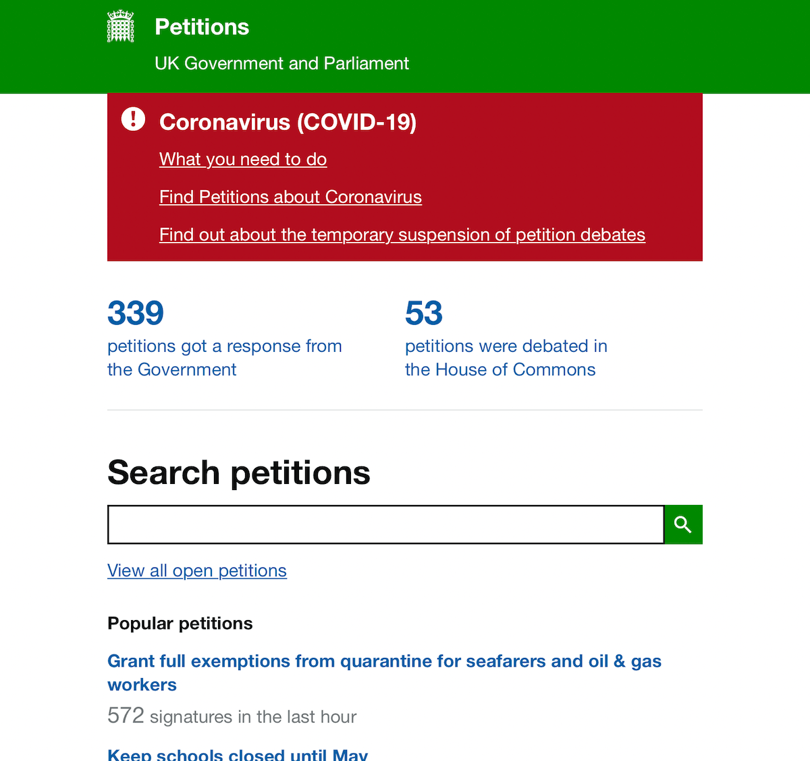

# GDS’s E-Petitions

|                   |                                          |
|:------------------|:-----------------------------------------|
| model             | Built Here, Others Use
| service type      | Public Services
| country           | United Kingdom
| government type   | central
| license           | open
| website           | [https://github.com/alphagov/e-petitions](https://github.com/alphagov/e-petitions)
| additional website| [https://petition.parliament.uk](https://petition.parliament.uk)

## Description
The UK’s Government Digital Service created an electronic petitions system, and it has been reused in Wales. (It’s not clear whether there are other reusers, or whether the petitions system was built with the intent of reuse.)
