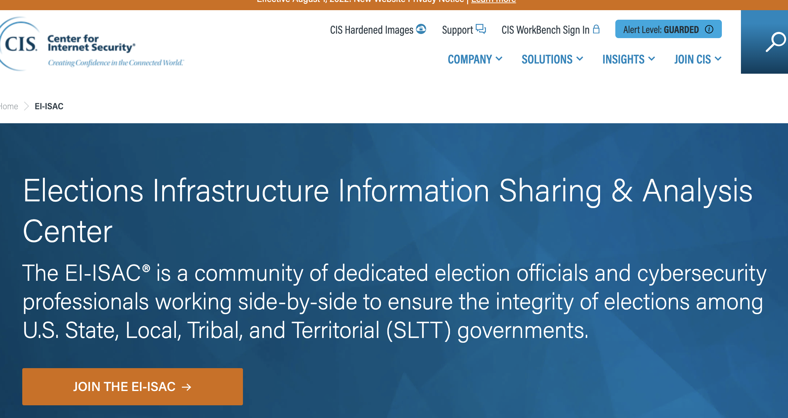

# Election Infrastructure Information Sharing and Analysis Center

|                   |                                          |
|:------------------|:-----------------------------------------|
| model             | Built Here, Others Use
| service type      | Information Security
| country           | United States
| government type   | mixed
| license           | unknown
| website           | [https://www.cisecurity.org/ms_isac](https://www.cisecurity.org/ms_isac)

## Description
They say:

>The EI-ISAC® is a community of dedicated election officials and cybersecurity professionals working side-by-side to ensure the integrity of elections among U.S. State, Local, Tribal, and Territorial (SLTT) governments.
>
>We are a trusted cybersecurity partner for election offices and associations, providing EI-ISAC membership to these organizations at no cost. Election vendors who support an EI-ISAC member may also be eligible to join as a supporting member.
>
>The EI-ISAC works closely with election officials and security and technology personnel to provide the highest standards of election security, including incident response and remediation through our team of cyber experts. Our 24x7x365 Security Operations Center (SOC) monitors, analyzes, and responds to cyber incidents targeting election offices and government entities. We develop and share best practices for securing election infrastructure, incorporating security into election technology procurements, and helping manage election supply chain risks.

The EI-ISAC is governed by an Executive Committee that is made up of EI-ISAC member-representatives elected by other members. Two members of the Executive Committee serve as the Chair and the Vice Chair, and all committee members represent different organizations from state and local governments, tribal nations, territories, or the District of Columbia.
All 50 states and hundreds of U.S. territories, tribal nations, and local governments are represented in the MS-ISAC membership.

It is funded by the Cybersecurity and Infrastructure Security Agency (CISA) through an agreement with the Department of Homeland Security (DHS).

Members can join the EI-ISAC at no cost. Membership benefits include: 
* Direct access to cybersecurity advisories and alerts
* Vulnerabiliity assessments and incident response for entities experiencing a cyber threat
* Secure information sharing through the Homeland Security Information Network portal
* Tabletop exercises
* Weekly reports on malicious domains
* CISA initiatives
* CIS SecureSuite® membership
