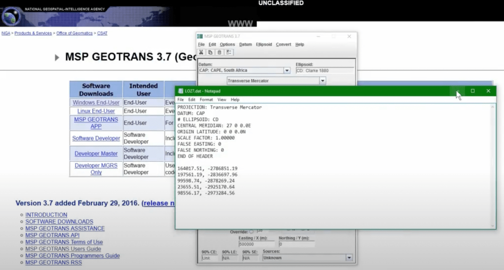

# GeoTrans

|                   |                                          |
|:------------------|:-----------------------------------------|
| model             | Unknown
| service type      | Information Technology
| country           | United States
| states            | 
| government type   | national
| license           | closed
| website           | [https://earth-info.nga.mil/GandG/geotrans/](https://earth-info.nga.mil/GandG/geotrans/)

## Description
The National Geospatial-Intelligence Agency’s Mensuration Services Program Geographic Translator is a coordinate converter and datum translator that runs in Windows and Linux. This software is produced and shared by NGA, but it’s not obvious that it is intentionally shared with other agencies (as opposed to simply open sourced).
