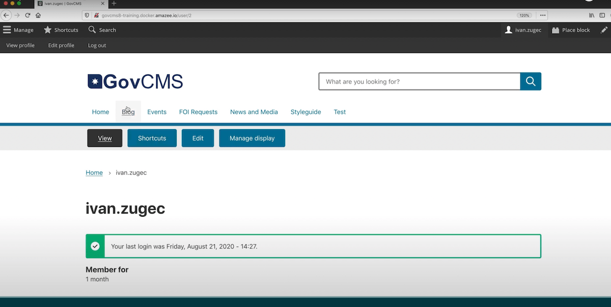

# GovCMS

|                   |                                          |
|:------------------|:-----------------------------------------|
| model             | Top-Down
| service type      | Information Technology
| country           | Australia
| government type   | national, state, and local
| license           | open
| website           | [https://www.govcms.gov.au/](https://www.govcms.gov.au/)

## Description
This Drupal-based CMS is created and maintained by Australia’s national government, and it is available in SaaS, PaaS, and self-hosted options. It’s in use across 96 organizations (agencies and ministries) at all levels of Australian government.
