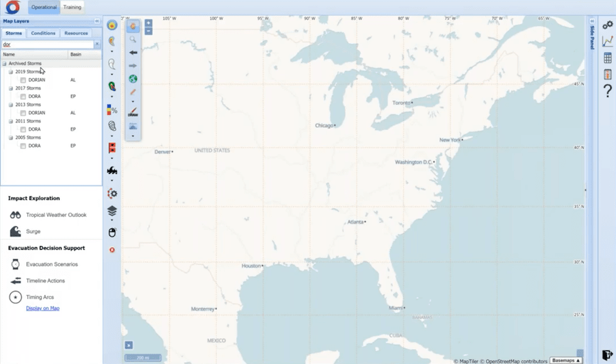

# HURREVAC

|                   |                                          |
|:------------------|:-----------------------------------------|
| model             | Top-Down
| service type      | Emergency Services
| country           | United States
| states            | AL, CT, DE, FL, GA, LA, MA, MD, ME, MS, NC, NH, NJ, NY, PA, SC, TX, VA, VT, DC, PR, VI
| government type   | state
| license           | unknown
| website           | [hurrevac.com](https://www.hurrevac.com/)
| manual            | [fs.fed.us/nrs/pubs/gtr/gtr_nrs128.pdf](https://www.fs.fed.us/nrs/pubs/gtr/gtr_nrs128.pdf)

## Description

From their website:

>HURREVAC is the decision support tool of the [National Hurricane Program](https://www.fema.gov/emergency-managers/risk-management/hurricanes), administered by FEMA, the USACE, and the NOAA National Hurricane Center.
>
>HURREVAC (short for Hurricane Evacuation) is a storm tracking and decision support tool. The software combines live feeds of tropical cyclone forecast information with data from various state Hurricane Evacuation Studies (HES) to assist the local emergency manager in making evacuation decisions based on the timing and potential severity of storm effects such as wind and storm surge.
>
>Software access is restricted to officials in government emergency management. As a general rule, if you are the Emergency Manager for a county in the hurricane prone states (Texas to Maine), in Puerto Rico or the Virgin Islands, state Emergency Management Agency (EMA), a FEMA office, Corps of Engineers office, or National Weather Service office, you are eligible to use the HURREVAC program.

National Hurricane Center, Interagency Coordinating Committee on Hurricanes, National Emergency Management Association (NEMA) Policy Subcommittee on Response and Recovery, and the Subcommittee on Hurricanes all give recommendations on how to improve HURREVAC.

HURREVAC is a web-based tool.
