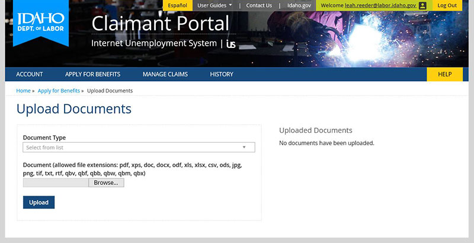

# Internet Unemployment System

|                   |                                          |
|:------------------|:-----------------------------------------|
| model             | Built Here, Others Use 
| service type      | Social Services
| country           | United States
| states            | ID, VT, IA, ND
| government type   | state
| license           | unknown
| status            | dissolved
| website           | [https://www.labor.idaho.gov/dnn/iUS](https://www.labor.idaho.gov/dnn/iUS)
| another website   | [https://www.govtech.com/health/idaho-sells-home-grown-unemployment-system-to-iowa-and-vermont.html] (https://www.govtech.com/health/idaho-sells-home-grown-unemployment-system-to-iowa-and-vermont.html)

## Description
They say:

>"With an antiquated, costly mainframe system built in the 1970s, the Idaho Department of Labor was pressed to find an alternate viable solution. As a result, the administration used 12 in-house employees and spent approximately $7 million to develop the iUS (Internet Unemployment System) to more efficiently manage unemployment processes."

An unemployment insurance software consortium that included Idaho, Vermont, Iowa, and North Dakota. The states began their collaboration in 2017, with Idaho leading the work developing the .NET-based software. Vermont partnered with Idaho and, initially, Iowa in the iUS consortium to leverage and build upon Idaho's iUS. Idaho developed the first version of the iUS benefits system with state staff and added modules to meet their and partner states' needs. 

Soon after work began, Iowa left the consortium due to conflicting technical requirements (they wanted something Java-based) and concerns over the state's ability to support the underlying .net technology (versus the Java platform they were using). North Dakota later joined as they realized this was the most cost-effective manner to update their own legacy systems. [Hawaii planned to join](https://www.govtech.com/computing/Have-State-Unemployment-Insurance-Systems-Recovered-from-COVID-19.html), looking to pay Idaho to migrate Hawaii’s data to Idaho’s system.

The US Department of Labor (USDOL) had provided funding to states to form consortiums that modernized the unemployment insurance systems from decades-old mainframe systems to shared, modern technology.

Nicknamed "iUS," it was dissolved in early 2020, after three years of work. In early 2020, Vermont Secretary of Digital Services John Quinn provided [an account of why the state pulled out of the consortium](https://vermontdailychronicle.com/2020/04/22/scott-pulled-plug-on-troubled-ui-upgrade-then-this-pandemic-hit/):

>There have been serious challenges related to 1) consortium and system governance; 2) communication, documentation, and long-term planning; and, 3) the quality and sustainability of what [Idaho] is developing and delivering. The underlying issue is that [Idaho] is not willing to give up intellectual property rights of the system being developed, and they will not hesitate to act in the best interest of their state regardless of the effect on the consortium or partner states.

In short, Idaho believed they had agreed on a "build here, others use" model, while the other members believed they had agreed on a "collaborative organizational development" model.

The governors of the three member states decided that their differences could not be resolved, and they agreed to dissolve the consortium.

According to [a report from early 2021](https://www.govtech.com/computing/Have-State-Unemployment-Insurance-Systems-Recovered-from-COVID-19.html), Idaho is no longer seeking to share its software with other states.
