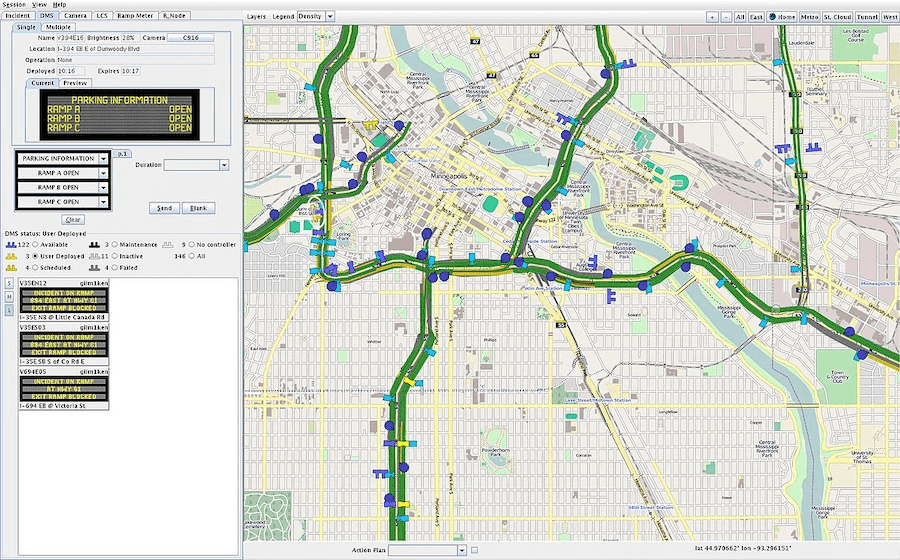

# Intelligent Roadway Information System

|                   |                                          |
|:------------------|:-----------------------------------------|
| model             | Built Here, Others Use
| service type      | Transportation
| country           | United States
| states            | CA, MN, NE, WY
| government type   | state
| license           | closed
| Website           | [http://iris.dot.state.mn.us/](http://iris.dot.state.mn.us/)
| Manual            | [https://mnit-rtmc.github.io/iris/](https://mnit-rtmc.github.io/iris/)
| GitHub org.       | [https://github.com/mnit-rtmc](https://github.com/mnit-rtmc)

## Description

IRIS is by transportation agencies to monitor and manage interstate and highway traffic.

Also used by California, Nebraska, and Wyoming. Client/server architecture, written in Java, released under the GPL. This is maintained by Minnesota, with no formal process to coordinate with other states, but other states routinely contribute back their own modifications.

The project was started by Doug Lau at the Minnesota Department of Transportation (MNDOT) in 1999. In 2007 MNDOT realized that other states could use this software, and they decided to share it. They contacted the California Department of Transportation (Caltrans), which ran a small project to get it working with University of California at Davis and Stockton. Caltrans got it into production, finding that the open source aspect of IRIS “reduced life-cycle costs by approximately 72 percent compared with the full advanced software package used in urban areas,” [according to the Federal Highway Administration](https://www.fhwa.dot.gov/publications/publicroads/17marapr/05.cfm).

Today IRIS is in use in Minnesota, California, Nebraska, and Wyoming. None of the other states have implemented IRIS exactly as written, but had consultants make modifications to suit their needs — those modifications are contributed back to MNDOT, which usually adds them to the software.

There’s no formal governance structure, largely due to a lack of resources to bring that about.

The budget for IRIS consists entirely of the salary of creator Doug Lau, who continues in that role over two decades later. IRIS development is led by user needs, with Lau holding regular meetings with system operators to discuss how they use the system. He works in the same building as MNDOT's system operators, so he’s able to directly observe how they use the system.

Because IRIS is a one-man operation, there’s nobody promoting IRIS to other states. But there are a pair of vendors with IRIS experience that will bid on their RFPs, proposing to implment IRIS.
