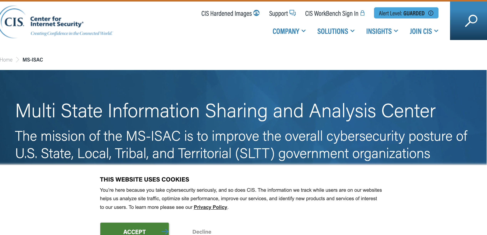

# Multi-State Information Sharing and Analysis Center (MS-ISAC)

|                   |                                          |
|:------------------|:-----------------------------------------|
| model             | Built Here, Others Use
| service type      | Information Security
| country           | United States
| government type   | mixed
| license           | unknown
| website           | [https://www.cisecurity.org/ms_isac](https://www.cisecurity.org/ms_isac)

## Description
The MS-ISAC is a trusted cybersecurity partner for over 13,000 U.S. State, Local, Tribal, and Territorial (SLTT) government organizations; U.S. State and Territory Homeland Security Advisors; and DHS-recognized Fusion Centers and local law enforcement entities. Their mission is to improve the overall cybersecurity of SLTT government organizations.

They use a team of security experts to perform incident response and remediation, providing threat analysis and early warning notifications as well as real-time network monitoring and management. They also develop tactical, strategic, and operational intelligence and advisories to provide members with information to help them improve their cyber protections.

They say:

>The MS-ISAC works closely with federal partners at DHS, along with Federal Bureau of Investigation, U.S. Secret Service and others to better share information on emerging threats. The MS-ISAC also has strong relationships with major internet service providers, cybersecurity firms, researchers, and software developers.

All 50 states and hundreds of U.S. territories, tribal nations, and local governments are members of the MS-ISAC. Membership is open to all U.S. SLTT government entities. Members must agree to the Terms and Conditions to join. Benefits include having direct access to cybersecurity advisories and alerts, vulnerability assessments and incident response, secure information sharing through the Homeland Security Information Network (HSIN) portal, a weekly malicious domains report, and more.
