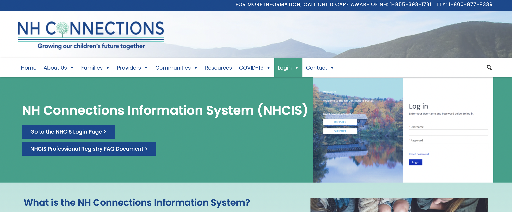

# New Hampshire Connections Information System

|                   |                                          |
|:------------------|:-----------------------------------------|
| model             | 
| service type      | Information Technology
| country           | United States
| states            | MA, NH
| government type   | state
| license           | 
| website           | [https://www.nh-connections.org/providers/nh-connections-information-system/] (https://www.nh-connections.org/providers/nh-connections-information-system/)

## Description
They say:

>NHCIS is an online platform developed to date in partnership with Massachusetts. In April 2020, the Bureau Chief facilitated the development of a MOU between NH DHHS, NH Department of Information Technology and Mass LEAD (Licensing Education Analytic Database) to share bi-directionally source code and software used to build each system and thus, decreased the cost and expedited the time for system development. 

>NHCIS includes provider profiles and related child care search, child care referrals tracking, licensing, background checks, registry, subsidy, credentialing, professional development modules, technical assistance tracking. NHCIS replaced both the My Licensed Office (MLO) system used for child care licensing functions and the National Data System for Child Care (NDS) application through Child Care Aware of America, which was used for resource and referral functions and included the professional registry and professional development training and technical assistance tracking.

>The shared NHCIS database has necessitated regular coordination between the Child Care Licensing Unit (CCLU) and the Bureau of Child Development and Head Start Collaboration (BCDHSC) as the information, input and stakeholder experience, both internal and external, require ongoing coordination and communication. This overall coordination has resulted in not only a better stakeholder communication, but also a more concise and collaborative approach to supporting programs, communicating the relationship between federal compliance and licensing rules and policies, and support of increased efforts towards enhancing quality in addition to compliance.

NHCIS captures workforce data, including demographics, employment, education, and professional development.

They operate internally within specific divisions or bureaus, but can be utilized throughout the department or by other NH state departments, either by approved access to specific database fields, or data upload to the Electronic Data Warehouse (EDW). 
