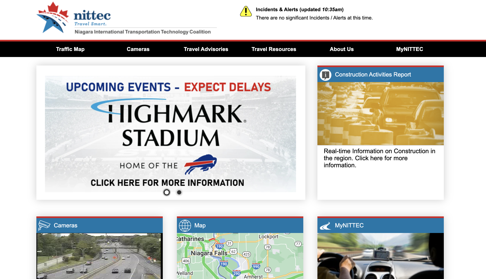

# AASHTOWare

|                   |                                          |
|:------------------|:-----------------------------------------|
| model             | Collaborative Organizational Development
| service type      | Transportation
| country           | United States, Canada
| government members| New York, Ontario
| government type   | mixed
| license           | unknown
| website           | [https://www.nittec.org/index.html](https://www.nittec.org/index.html)

## Description

They say:

>Niagara International Transportation Technology Coalition (NITTEC) is a coalition of agencies developed to help get you where you are going more safely and efficiently.
>
> NITTEC provides real-time traffic and roadway information to improve traffic flows, and enhance emergency assistance for motorists using the transportation system. Less time spent in congested traffic means less energy consumption, less air pollution, and reliable travel times for personal and business travel.
