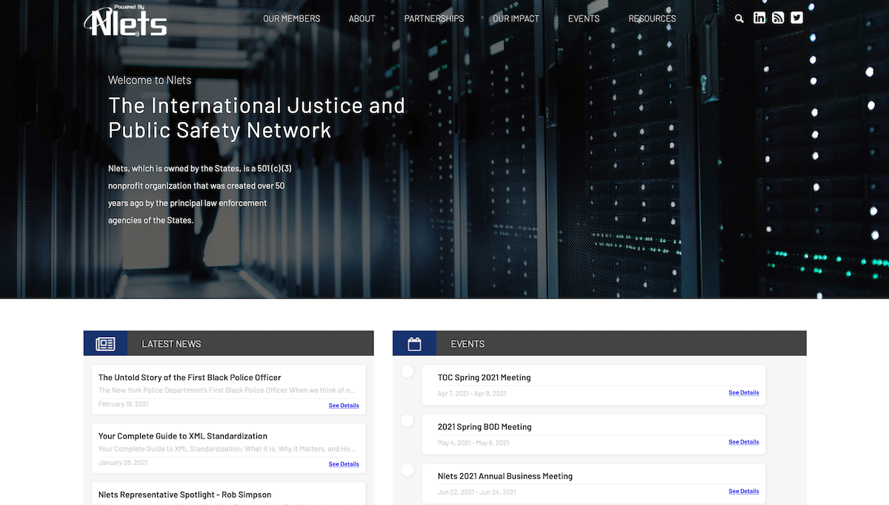

# Nlets

|                   |                                          |
|:------------------|:-----------------------------------------|
| model             | Collaborative Organizational Development
| service type      | Law Enforcement
| country           | United States
| states            | AK, AL, AR, AZ, CA, CO, CT, DE, FL, GA, HI, IA, ID, IL, IN, KS, KY, LA, MA, MD, ME, MI, MN, MO, MS, MT, NC, ND, NE, NH, NJ, NM, NV, NY, OH, OK, OR, PA, RI, SC, SD, TN, TX, UT, VA, VT, WA, WI, WV, WY, GU, DC
| government type   | state
| license           | unknown
| website           | [nlets.org](https://www.nlets.org/)

## Description

[Nlets describes themselves as such](https://www.nlets.org/about/who-we-are):

> Nlets, is a private not for profit corporation  owned by the States that was created more than 50 years ago by the 50 state law enforcement agencies. The user population is made up of all of the United States and its territories, all Federal agencies with a justice component, selected international agencies, and a variety of strategic partners that serve the law enforcement community-cooperatively exchanging data.

[Nlets describes their work as such](https://www.nlets.org/about/what-we-do):

>Nlets links together and supports every state, local and federal law enforcement, justice and public safety agency for the purposes of sharing and exchanging critical information. [...] Through the Nlets network, law enforcement and criminal justice agencies can access a wide range of information, from standard driver license and vehicle queries to criminal history and Interpol information. The array of services we provide is constantly expanding as we strive to meet the growing demands for information by the agencies that protect life and liberty.

Every state pays the same price at a monthly rate that contributes to the bottom line of their core services. They also do cloud hosting with certain strategic partners and take transaction fees. 

The [Technical Operations Committee] (https://nlets.org/about/committees) provides information and poilicy guidance to the Nlets Board of Directors (BOD) on matters of operations, maintenance, and enhancement of the Nlets system. They are the main governing members who provide product and user feedback on the Nlets system. 

The Nlets staff decides and drives 99% of what the product does, but they validate with their members. They have about 46 staff, about half of which is technical.

The Brodie Assistance Fund (BAF) is a fund available to Nlets Representatives and their staff to support the continued development of services and technologies that directly benefit the Nlets mission and vision. 

Nlets set aside some of their excess revenue to help pay the state's contractor, usually their switch provider. This does away with all of the whole bureaucracy. They don't have to go through procurement. They've invested $3.5 million back into the states to get them to move off of legacy systems and to XML and NIEM.

Development of the Nlets switch system was and is in-house. 
