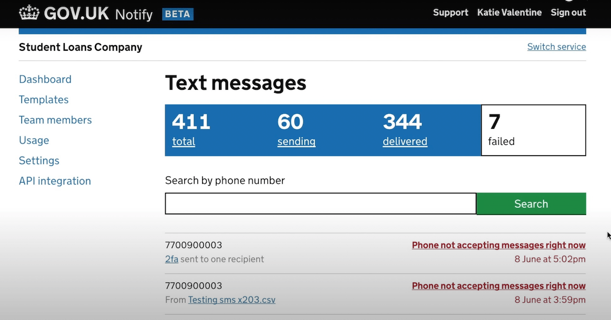

# Notify

|                   |                                          |
|:------------------|:-----------------------------------------|
| model             | Built Here, Others Use
| service type      | Communication
| countries         | United Kingdom, Canada, Australia, U.S.
| government type   | national
| license           | open
| Website           | [https://www.notifications.service.gov.uk/](https://www.notifications.service.gov.uk/)
| GitHub            | [https://github.com/alphagov/notifications-api](https://github.com/alphagov/notifications-api)

## Description

Notify is a Software-as-a-Service tool, hosted by a central authority, that participating agencies can use to send emails, text messages, and postal letters. Agencies can make an API call to Notify, specifying a message and a recipient, and Notify handles rendering it as an email, text message, or printed letter, and then sending it.

Notify was created by [the UK’s Government Digital Service](https://www.gov.uk/government/organisations/government-digital-service), and they are the only country to deploy it at a wide scale. They make it available to localities, the military, government schools, government health services, and national government agencies.

As a result of this approach, Notify is a sort of cooperative of cooperatives, with each installation of the software serving all members of that particular cooperative.

[Canada](https://notification.canada.ca/) and [Australia](https://notify.gov.au/) digital services host their own versions of Notify for the benefit of their governments. Australia limits the functionality to text messages and emails (not postal letters). [Canada reports](https://notification.canada.ca/activity) that 73 “services” are using Notify, and [Australia reports](https://notify.gov.au/) 238 federal customers, 118 state/territory customers, and 31 local government customers.

[Notify was put into use by the U.S. Department of Veterans Affairs in February of 2021](https://www.thoughtworks.com/news/vanotify), branded as “VANotify.” [Their work is available on GitHub](https://github.com/department-of-veterans-affairs/notification-api).
