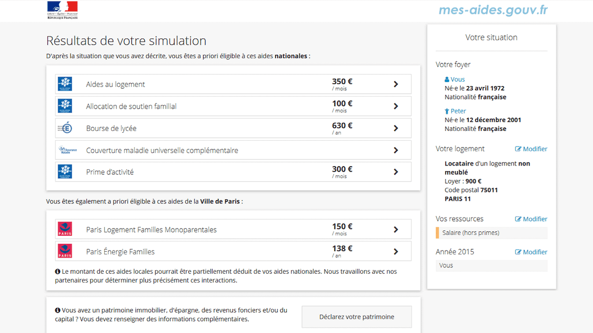

# OpenFisca

|                   |                                          |
|:------------------|:-----------------------------------------|
| model             | Built Here, Others Use
| service type      | Social Services
| country           | France
| states            | 
| government type   | national
| license           | GNU Public License
| website           | [https://openfisca.org/](https://openfisca.org/)

## Description

OpenFisca is an open source project that allows you to turn legislation into code. Describe your tax & benefit system, provide a situation as input (i.e income), ask for a calculation as output (i.e. income tax), and get your results.

Created by France Stratégie (under the prime minister), expanded by Etalab, and later had “new contributors from other French agencies, as well as international reusers with Barcelona joining Tunisia.”

Development began in 2011. It was open sourced the same year, and Etalab became heavily involved in 2014.
