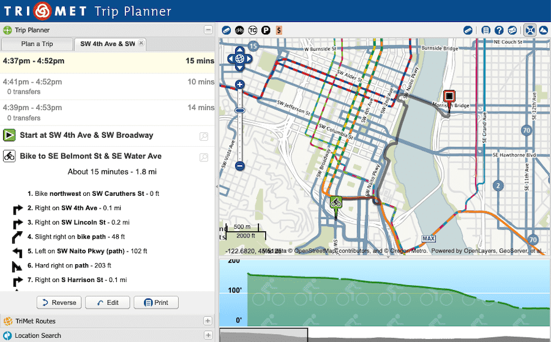

# OpenTripPlanner

|                   |                                          |
|:------------------|:-----------------------------------------|
| model             | Built Here, Others Use
| service type      | Transportation
| country           | United States
| states            | CA, FL, GA, OR, VA, VT, WA
| government type   | state
| license           | open
| website           | [opentripplanner.org](http://www.opentripplanner.org/)
| repository		   | [github.com/opentripplanner](https://github.com/opentripplanner)
| governance			| [docs.opentripplanner.org/en/latest/Governance](http://docs.opentripplanner.org/en/latest/Governance/)

## Description
“OpenTripPlanner (OTP) is a family of open source software projects that provide passenger information and transportation network analysis services. The core server-side Java component finds itineraries combining transit, pedestrian, bicycle, and car segments through networks built from widely available, open standard OpenStreetMap and GTFS data. This service can be accessed directly via its web API or using a range of Javascript client libraries, including modern reactive modular components targeting mobile platforms.” It was created by Oregon’s transit agency, and improvements continue to be made by an array of public transportation agencies.

OpenTripPlanner is a member project of Software Freedom Conservancy, a 501(c)(3) organization incorporated in New York, and donations made to it are fully tax-deductible to the extent permitted by law. Donations can be made by credit card, wire transfer or paper check. Please contact accounting@sfconservancy.org for instructions. 

OTP development is primarily carried out by full-time software engineers employed by transportation authorities and consultancies. Even with funding, it can be difficult to engage staff who have the specialized skill set required. Therefore, one of the best ways to support OTP is to allocate software development staff at your organization with transportation domain knowledge to participate in weekly development meetings and contribute to this effort. This also builds connections between organizations favoring open source collaboration.
