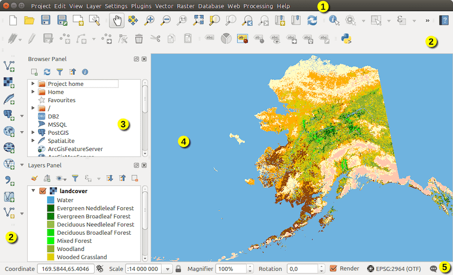

# QGIS

|                   |                                          |
|:------------------|:-----------------------------------------|
| model             | Built Externally, Agencies Contribute
| service type      | Other
| country           | United States
| states            | 
| government type   | 
| license           | open
| website           | [https://www.qgis.org/](https://www.qgis.org/)
| governance docs	| [https://www.qgis.org/en/site/getinvolved/governance/](https://www.qgis.org/en/site/getinvolved/governance/)

## Description
Although QGIS is not a government-created or -maintained tool, the changelog to this popular open source GIS tool shows new features that were developed by or funded by local governments that required that functionality (e.g., manually created fixed tables).
