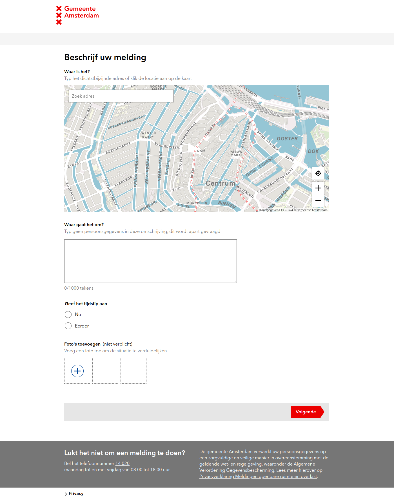

# Signalen

|                   |                                          |
|:------------------|:-----------------------------------------|
| model             | Collaborative, Independent Development
| service type      | Public Services
| country           | Netherlands
| states            | 
| government type   | local
| license           | open
| website           | [signalen.org](https://signalen.org/)

## Description

Signalen is an open source process and task system for governments, which automatically categorizes and routes reports about public space for processing by the appropriate handler.

### Classify notifications

Residents, visitors and companies make their reports about the public space in a text field on a page on the municipality's website. This text field is in fact an interactive portal. The reporter doesn't have to choose a category for the report. Signalen automatically assigns them, based on hundreds of thousands of previously classified reports. Municipalities that are going to use Signalen train the algorithm with their own data in their own classifications.

### Routing notifications

The automatic classification can be linked to dynamic routing. This means that based on the category of a notification, it is automatically referred to the correct handler and/or department. Each municipality configures Signalen for its own local situation.

### Handling reports

Employees handling notifications always see the current status of a notification in Signalen, and its history. That screen can be personalized to a certain extent, for greater ease of work.

Employees do not need new login details to work with Signalen. Logging in is the same as with the other municipal systems using Single Sign On.

### Report

Signalen can easily be linked to reporting tools such as Tableau. Reports on public space reports can therefore be set up according to your own wishes.
