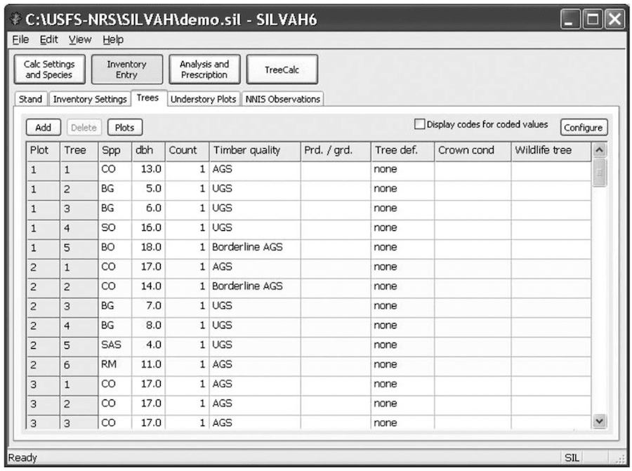

# US Forest Service’s SILVAH

|                   |                                          |
|:------------------|:-----------------------------------------|
| model             | 
| service type      | Environmental
| country           | United States
| states            | KY, NY, OH, PA, WV
| government type   | state
| license           | public domain
| website           | [nrs.fs.fed.us/tools/silvah](https://www.nrs.fs.fed.us/tools/silvah/)
| manual            | [fs.fed.us/nrs/pubs/gtr/gtr_nrs128.pdf](https://www.fs.fed.us/nrs/pubs/gtr/gtr_nrs128.pdf)

## Description

The U.S. Forest Service describes their tool like such:

>SILVAH (short for Silviculture of Allegheny Hardwoods) is a computer tool for making silvicultural decisions in hardwood stands of the mid-Atlantic and upper Appalachian region. It is an "expert system" in that it recommends appropriate treatments based upon user objectives and overstory, understory, and site data provided by the user. SILVAH also contains a wildlife attributes report, forest stand growth simulator, provides the ability to test alternative cuts, enables development of a forest-wide inventory database, and facilitates other forest management planning functions. 

This Windows-based desktop software was originally created in 1985, has been continuously improved since.
