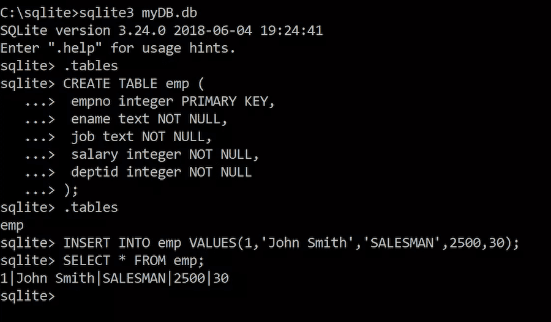

# SQLite Consortium

|                   |                                          |
|:------------------|:-----------------------------------------|
| model             | Built Open, Then Privatized
| service type      | Other
| country           | United States
| license           | public domain
| URL               | [https://sqlite.org/](https://sqlite.org/)

## Description

The SQLite database was created in 2000 by a U.S. Navy contractor, General Dynamics, as part of a damage-control system for guided-missile destroyers. Its author, Dr. Richard Hipp, was trying to create an extremely lightweight database, with no permissions, administrator, or management system.

Today, SQLite is ubiquitous, and is bundled with every computer and handheld computing device, often providing core functionality for operating system. Dr. Hipp continues to maintain it. The vast majority of its applications within government are under the hood of commercial tools, as opposed to explictly choosing to use SQLite. Government agencies do not seem to be meangingful contributors to SQLite’s development at this point.

Because of it was procured under a federal contract, SQLite is in the public domain, rather than being published under a traditional open source license.
