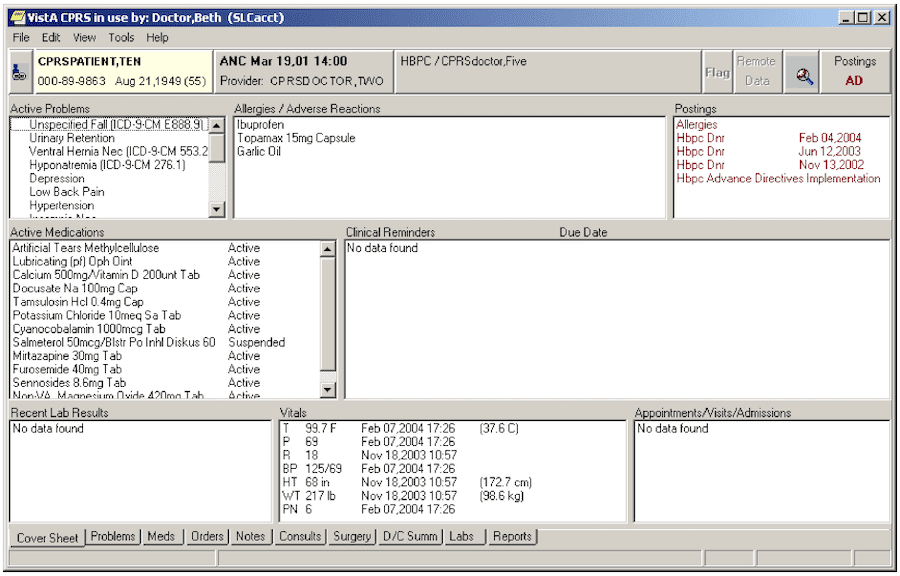

# Veterans Health Information Systems and Technology Architecture

|                   |                                          |
|:------------------|:-----------------------------------------|
| model             | Built Here, Others Use
| service type      | Public Health
| country           | United States
| states				    | AZ, CA, FL, HI, OK, NJ, NY, TX, WV, DC
| government type   | state, federal
| license           | open
| website           | [https://en.wikipedia.org/wiki/VistA#Usage_in_non-governmental_hospitals](https://en.wikipedia.org/wiki/VistA#Usage_in_non-governmental_hospitals)

# Description
“VistA is a health information system deployed across all veteran care sites in the United States. VistA provides clinical, administrative, and financial functions.” 

The system and the front-end GUI are provided as open-source software. The VA has created a version that runs on GT.M on Linux, said to be to meet the needs of private healthcare organizations. It is in use in non-VA healthcare facilities around the U.S. (Whether these extra-VA uses are incidental or intentional to the VA’s development efforts is unclear.) Its use globally is promoted and contributed to via WorldVistA. It is unclear whether WorldVistA is a membership organization.
