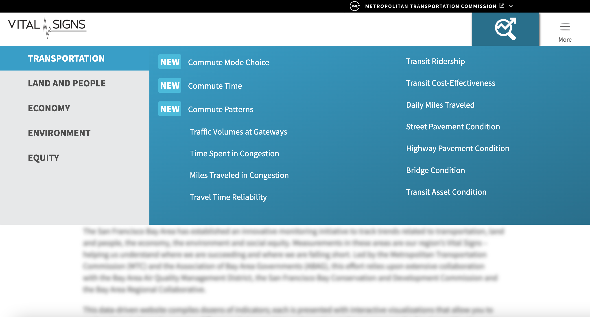

# Vital Signs

|                   |                                          |
|:------------------|:-----------------------------------------|
| model             | Built Here, Others Use
| service type      | Transportation, Justice, Environmental, Employment
| country           | United States
| government members | Metropolitan Transportation Commission, Association of Bay Area Governments, Bay Area Air Quality Management District, San Francisco Bay Conservation and Development Commission, Bay Area Regional Collaborative
| government type   | mixed
| license           | unknown
| website           | [https://www.vitalsigns.mtc.ca.gov/about](https://www.vitalsigns.mtc.ca.gov/about)

## Description
They say:

>The San Francisco Bay Area has established an innovative monitoring initiative to track trends related to transportation, land and people, the economy, the environment and social equity. Measurements in these areas are our region’s Vital Signs – helping us understand where we are succeeding and where we are falling short. Led by the Metropolitan Transportation Commission (MTC) and the Association of Bay Area Governments (ABAG), this effort relies upon extensive collaboration with the Bay Area Air Quality Management District, the San Francisco Bay Conservation and Development Commission and the Bay Area Regional Collaborative. This data-driven website compiles dozens of indicators; each is presented with interactive visualizations that allow you to explore historical trends, examine differences between cities and counties, and even compare the Bay Area with other peer metropolitan areas. Let’s track our region’s Vital Signs!

It is governed by the Metropolitan Transportation Commission and the Association of Bay Area Governments.
