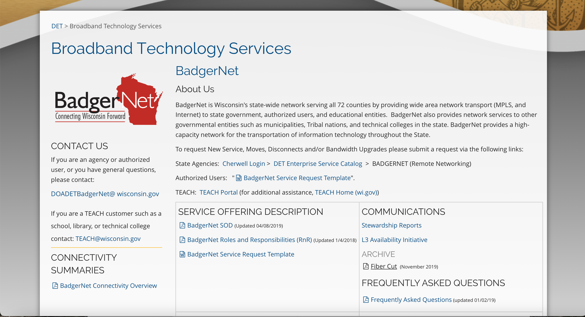

# Wisconsin BadgerNet

|                   |                                          |
|:------------------|:-----------------------------------------|
| model             | Top-Down
| service type      | Other
| country           | United States
| states            | WI
| government type   | state
| license           | unknown
| website           | [https://det.wi.gov/Pages/BadgerNet.aspx](https://det.wi.gov/Pages/BadgerNet.aspx)

## Description
They say:

>BadgerNet is Wisconsin's state-wide network serving all 72 counties by providing wide area network transport (MPLS, and Internet) to state government, authorized users, and educational entities.  BadgerNet also provides network services to other governmental entities such as municipalities, Tribal nations, and technical colleges in the state. BadgerNet provides a high-capacity network for the transportation of information technology throughout the State.

It has four goals: 
* Improve services in the State of Wisconsin by embracing technologies that are self-service, digital-first, and modern
* Secure State systems and data by refining strategies used to mitigate risk for key stakeholders and individuals
* Modernize state agency legacy data and technology assets to make the delivery of government services and operations more efficient and effective
* Adopt practices that strengthen the workforce within Wisconsin's state government

BadgerNet has a Division of Enterprise Technology, which delivers policy insights, strategic IT thinking and purchasing support, and the standards needed to ensure organizations at every level of government can find, procure, and implement technology. They have a flexible organization framework, allowing multiple different people to make and communicate decisions.

They also have an Enterprise IT Council, which acts as a forum for communication and collaboration for members of the State of Wisconsin's Executive Branch IT Directors and other key IT leadership in the state. This council works to improve IT practices across the agencies, as well as share priorities, key technology policies, and enhanced utilization of technology within the state. The Council acts as a sounding board for large scale IT projects and discussion.
