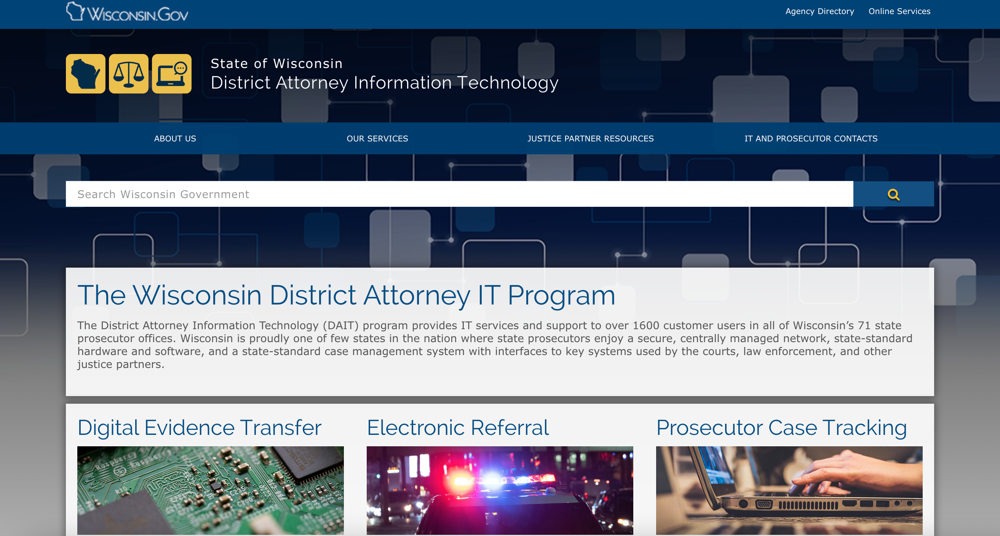

# Wisconsin District Attorney IT Program

|                   |                                          |
|:------------------|:-----------------------------------------|
| model             | Top-Down
| service type      | Information Technology
| country           | United States
| states            | WI
| government type   | state
| license           | unknown
| website           | [https://dait.wi.gov/Pages/about-us.aspx](https://dait.wi.gov/Pages/about-us.aspx)

## Description
They say:

>Wisconsin's District Attorney Information Technology program (DAIT) provides IT services and support to over 1600 customer users in all of Wisconsin’s 71 state prosecutor (district attorney) offices. Wisconsin state prosecutors enjoy a secure, centrally managed network, state-standard hardware and software, and a state-standard case management system with interfaces to key systems used by the courts, law enforcement, and other justice partners. 

The District Attorney Information Technology (DAIT) program provides IT services and support to over 1600 customer users in all of Wisconsin’s 71 state prosecutor offices. Wisconsin is proudly one of few states in the nation where state prosecutors enjoy a secure, centrally managed network, state-standard hardware and software, and a state-standard case management system with interfaces to key systems used by the courts, law enforcement, and other justice partners. Since 1996, DAIT has worked with its users to transition them from independent county networks to the statewide DA Network. This network is stable, consistent, and secure. 

In 2014, DAIT implemented and managed a case management system called Prosecutor Technology for Case Tracking, or [PROTECT](https://dait.wi.gov/Pages/uniform-software.aspx). PROTECT helps prosecutors meet the changing needs for data sharing among justice partners and take advantage of opportunities for automation and paperless e-business.

DAIT is governed by the Wisconsin District Attorney Association and receives state funding. Participation in this program is voluntary. 
