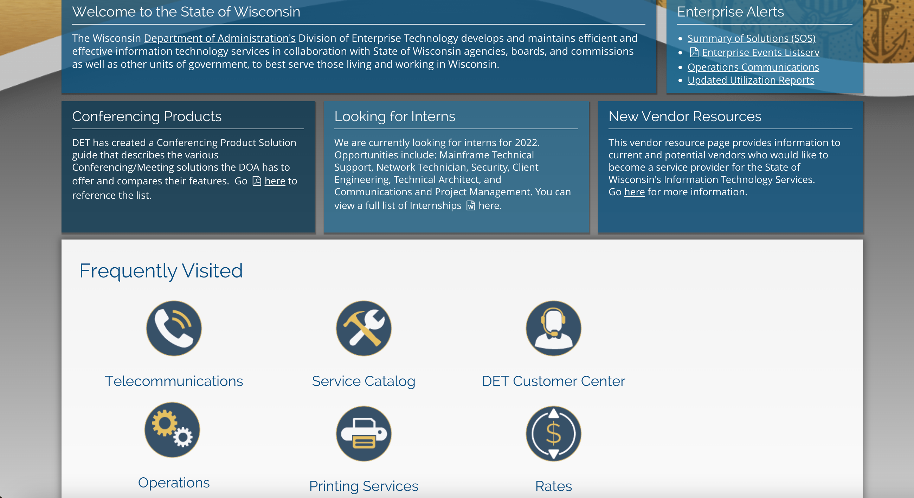

# State of Wisconsin Division of Enterprise Technology

|                   |                                          |
|:------------------|:-----------------------------------------|
| model             | Collaborative Organizational Development
| service type      | Information Technology
| country           | United States
| states            | WI
| government type   | state
| license           | unknown
| website           | [https://det.wi.gov/Pages/home.aspx](https://det.wi.gov/Pages/home.aspx)

## Description
The Wisconsin Department of Administration's Division of Enterprise Technology develops and maintains efficient and effective information technology services in collaboration with State of Wisconsin agencies, boards, and commissions as well as other units of government, to best serve those living and working in Wisconsin. It is governed and funded by the State of Wisconsin.

They say:

>We embrace the notion of “the Art of What is Possible” focused on digitization, modernization, and efficiencies to drive continuous improvement and service leadership. Mission: DET is committed to being a collaborative and transparent partner focused on enhancing the lives of Wisconsin residents through innovative, secure, and optimal government services.
