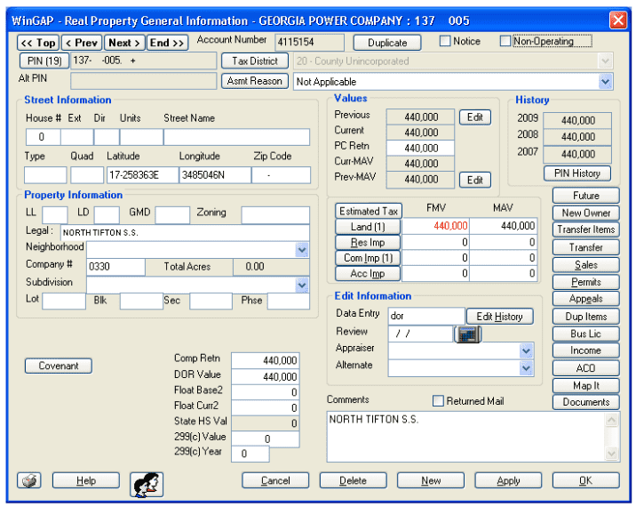

# WinGAP Computer Assisted Mass Appraisal

|                   |                                          |
|:------------------|:-----------------------------------------|
| model             | Built Here, Others Use
| service type      | Other
| country           | United States
| states            | GA
| government type   | state
| license           | unknown
| website           | [http://wingap.com/](http://wingap.com/)

## Description

WinGAP CAMA is the Windows-based appraisal software used in the State of Georgia property tax appraisal arena, employed by 145 of the 159 counties in Georgia. It is a cooperative effort of the Georgia Department of Revenue and GAP Group Inc., a non-profit organization, with a board comprised of representatives from member counties. Each member county pays annual dues to support the maintenance of the software. In 2019, [dues were set to $2,000](http://wingap.com/news/default.html), giving them an annual budget of under $250k. Each instance requires a Windows server running MSSQL and each workstation must run Windows.

There are a handful of counties that do not participate in WinGAP, all in the Atlanta metro area. Those counties use [Tyler Technologies’ CAMA product](https://www.tylertech.com/solutions/public-administration/appraisal-tax/computer-assisted-mass-appraisal), which is multiple orders of magnitude more expensive than WinGAP CAMA.

WinGAP cites a tight user-feedback loop as the key to their success. They find out what their members need, address that, and then continue to iterate.

### History

In 1987, the [Georgia Department of Revenue](https://dor.georgia.gov/) was approached by the [Tennessee Valley Authority](https://www.tva.com/), which proposed to invest money in computer software for the collection of property taxes in northern Georgia (which is part of the Tennessee Valley). After a meeting that included [Georgia's Extension Service](https://extension.uga.edu/), they concluded that they should spend $20,000 toward this. They found a professor at Mississippi State University who had written some similar software, and worked with him to build the Georgia Appraisal Program (GAP). The software was ready in 1989, and put into use in twelve counties.

The Georgia Department of Revenue provided staffing support through the mid-1990s, but today their support comes in the form of providing tech support.
