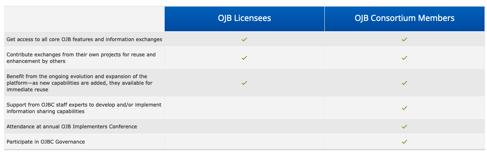

# Anatomy of a Collaborative: Open Justice Broker Consortium

*Date Updated: 11/18/2022*

*This case study is part of our [Anatomy of a Collaborative](/publications/anatomy-of-a-collaborative/) series.*

The [Open Justice Broker Consortium](https://www.ojbc.org/) is a non-profit membership organization of government agencies and jurisdictions, dedicated to improving justice information sharing through the reuse of low-cost, standards-based integration software.

## History
In 2010, System for the Electronic Analysis and Retrieval of Criminal Histories (SEARCH) created the Open Justice Broker Consortium (OJBC) as a project funded by the Law Enforcement Assistance Administration. SEARCH gave the Consortium $100,000 and set it up as a separate nonprofit. It has provided OJBC with administrative support and staff services since 2012, and the two groups’ relationship has supported both of their respective missions. The Consortium was created as a venue to enhance public safety data sharing through a set of open source software tools collectively referred to as the Open Justice Broker (OJB), with the goal of both reducing costs and increasing the speed of implementing an integrated justice system across the United States. 

## Governance
The Open Justice Broker Consortium is governed by a Board of Directors. Full members of the Consortium can vote for and serve on the Board. OJBC members are also typically members of SEARCH. The Board has final decision-making authority on all matters of Consortium governance.  OJBC meets regularly with members to determine product needs and direction. 

SEARCH provides staff, leadership, and operational support to OJBC, but the relationship is not one-directional. OJBC also appoints a permanent representative to sit on the SEARCH Board of Directors. This representative is currently Christopher D. W. Young, who previously served as an Administrator for the Hawaii Criminal Justice Data Center and the Department of the Attorney General.

## Membership
Membership runs from $995 a year to $85,000 a year, with three tiers of membership (Full, Support, and Associate) that come with different levels of technical support, additional software development, and ability to serve on the Board. Membership is open to any government agency, or partnership of such agencies, from any level of government in the U.S., such as municipal, county, state, tribal, Federal. Members may attend and receive financial support to travel to the annual OJB Implementers Conference and participate in OJBC Governance.

At the time of writing, the **Full** tier of membership at $85,000 per year consists of the founding states: Maine, Hawaii, Vermont, and Michigan. This comes with 500 hours of dedicated staff support per year for on-site or remote technical assistance and/or development work and eligibility to serve on and elect the Consortium Board of Directors.

The **Support** tier, whose members pay $24,995 a year, currently consists of Pima County, CA and Adams County, CO. This tier comes with 150 hours of dedicated staff support per year for on-site or remote technical assistance and/or development work.

Finally, members of the **Associate** tier at $995/year can receive up to 10 email or telephone consultations per year with Consortium staff to support OJB implementation.

OJBC does have some pricing flexibility and contract-based options, in order to make joining easier and support jurisdictions with unique needs. Through these more hybrid arrangements they have relationships with multiple other jurisdictions.

Jurisdictions do not need to become members of the consortium in order to use the software, because of the OJB's open source license model. The differences between licensees and consortium members is summarized on their [website](https://www.ojbc.org/membership/) and in the following table:

## Operations
While OJBC is a separate entity from SEARCH, SEARCH essentially staffs OJBC. The Executive Director/CEO of SEARCH Group is also the Executive Director of OJBC. This role is currently filled by Dave Roberts, whose background is in information technology, XML standards development, and justice and public safety consulting at all levels of government.  OJBC's technology leadership is filled by SEARCH's Director of Software and Data Engineering, Yogesh Chawla. 

OJBC team members describe themselves as working in a startup-like environment, with Yogesh leading two full-time programmers and one person who serves as both a programmer and standards manager. During a conversation with the Beeck Center in April 2022, OJBC was looking to expand technical staff, especially to focus on their Criminal History Analytics Dashboard.

OJBC is funded through membership fees, grants from SEARCH, and grant funding from philanthropic foundations and individual agencies. OJBC does actively respond to RFPs, believing they can provide a competitively priced option that uses their open source software as a bedrock (although not always as the complete solution in their RFP response) to help prevent vendor lock-in. 

## Tech
OJBC's software solution is called the Open Justice Broker (OJB), and consists of a set of integrated justice information sharing components built on the Apache integration stack (Spring Boot, CXF, Camel). The software is used to integrate records from police, prisons, and courts, making it possible to query records across disparate law enforcement records management systems. Their [whitepaper](http://www.ojbc.org/files/OJB-InformationSharingCapabilities.pdf) outlines the software's functionality, including standards-based federated data querying capabilities, data analytics, cross-agency automation of business processes through system integration, and event subscription to notify users of criminal or justice events. For example, in states using the OJB, probation officers can receive notifications alerting them when people they supervise have contact with law enforcement.

The states who were the original members of OJBC committed to a set of national standards, which helps the reuse of information exchange software. The OJB now includes over five dozen service specifications that conform to the [Global Reference Architecture](https://bja.ojp.gov/program/it/national-initiatives/gra), and according to their whitepaper, at least two members of the consortium have statewide identity federations that conform to the Global Federated Identity and Privilege Management [guidance](https://bja.ojp.gov/program/it/national-initiatives/gfipm). A significant aspect of OJBC's technical work involves taking state data and mapping it to these common standards so that it is interoperable, and making the data more accessible and analyzable.

The OJB is open source under the [Reciprocal Public License (RPL-1.5)](https://github.com/ojbc/main/blob/master/LICENSE.md) and can be found [on Github](https://github.com/ojbc) in repositories under the OJBC organization. Under this license, users of the software can modify and redistribute core OJB components, as long as these modifications are shared back with the community. Based on the contributor history of the [main repository](https://github.com/ojbc/main/graphs/contributors) or their [analytics repository](https://github.com/ojbc/analytics/graphs/contributors) on Github, it is unclear whether external contributors outside of SEARCH employers have contributed code to either project. In a conversation with the Beeck Center, the OJBC team has shared that they encourage contributors to participate in the form of conversation, feature requests, and bug reports, and that contributors typically use the OJBC listserv to submit this feedback. At that point an OJBC team member can take any necessary action such as fixing the bug.

The founders of OJBC chose to make it open source because they wanted to make it affordable. They believed that through lowering barriers to participation, enabling the reuse of what others have implemented at a low cost, ensuring that new changes are shared back with the community, and mitigating technology risk, they could further advance justice information sharing.

In addition to publishing their own products as open source, OJBC contributes to the wider open source technology ecosystem by creating or contributing to libraries, such as a [Mondrian REST API](https://github.com/ojbc/mondrian-rest), that are useful to a wide range of projects outside of the justice domain. 

While the OJB and some other software created by the consortium is open source, the OJBC team does sometimes build closed-source software as part of a specific contract with a jurisdiction.

## Market Landscape
OJBC staff have asserted that they do not want to compete with existing vendors in this space, but rather fill a gap that was not being met as well as provide open source reference implementations that push the space forward. One type of product that the OJB might compete with is referred to as the law enforcement records management system (RMS), numerous examples of which exist in the US. It has been [posited](https://www.hsaj.org/articles/17381) that a lack of a shared RMS and mandatory participation in data exchange has resulted in significant challenges to law enforcement agencies – and arguably OJBC exists to address these challenges through open source, interoperable shared services.

Some other software systems in this space are the FBI systems such as the [National Data Exchange (N-DEx)](https://le.fbi.gov/informational-tools/national-data-exchange-n-dex) and [National Incident-Based Reporting System (NIBRS)](https://www.fbi.gov/how-we-can-help-you/need-an-fbi-service-or-more-information/ucr/nibrs). N-Dex, maintained by the FBI, is an online tool for criminal justice agencies to share, search, link, and analyze information across jurisdictional boundaries, and NIBRS is a tool to collect detailed information about crime incidents. Neither of these systems appear to be open source, and NIBRS requires jurisdictions to procure software (such as the OJB) to integrate with it. OJBC’s technology supports gateways to national services like N-DEx and NIBRS, and SEARCH, OJBC's parent organization, has also [built](https://github.com/SEARCH-NCJIS/nibrs) a free and open source [tool](https://nibrs.search.org) for NIBRS validation, report generation, and flat file to XML conversion.

## Successes and Challenges
Four of OJBC’s Full tier member states have [highlighted](https://www.ojbc.org/benefits/) successes they have had with the platform. For example, some states have been able to implement federated queries for statewide criminal history, bench warrants database, county firearms registries, and incident and arrest information; automate re-arrest subscriptions for officers and manual subscriptions used by prosecutors; automatically notify probation officers of law enforcement contact events; and automate warrant requests, packing, issuance, and service among law enforcement.

In 2015, Open Justice Broker Consortium received the [Inaugural Technology Award](https://www.search.org/open-justice-broker-consortium-receives-inaugural-technology-award-from-code-for-america-and-google/) from Code for America and Google in 2015, which recognizes innovative technology-based projects in U.S. government agencies. They were recognized for the way their platform supports information sharing and integration in the justice system, as well as the benefits of open source software and cross-boundary collaboration.

Some challenges that the Consortium has faced existing relationships between jurisdictions and vendors, since they may be seen as a competitor or want to push the market forward with standards and open source, and branding. They have experienced some confusion related to their identity, specifically their relationship with and distinction from SEARCH, which supports OJBC but is a legally separate entity. They also have found that they must combat myths related to open source, and have even published a [whitepaper](http://www.ojbc.org/files/CommonMythsOpenSourceInGovt.pdf) to debunk these myths. At the time of this writing, the OJBC website has some content that is older or out of date, but the Consortium is still active and the team is working on a website redesign.

## Acknowledgements
*We compiled this case study for our Anatomy of a Collaborative series primarily using publicly available information online, such as on the OJBC website, Github, and LinkedIn. We'd also like to thank SEARCH's Executive Director, Dave Roberts, and Director of Software Engineering, Yogesh Chawla, for speaking with us in April 2022 to share more details of the vision, operations, challenges, and successes of OJBC to date.*
